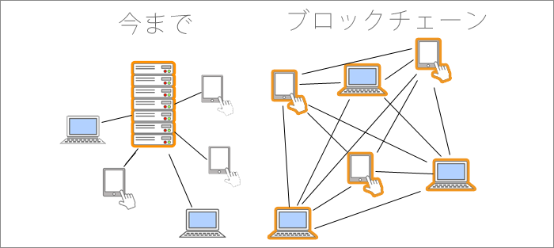
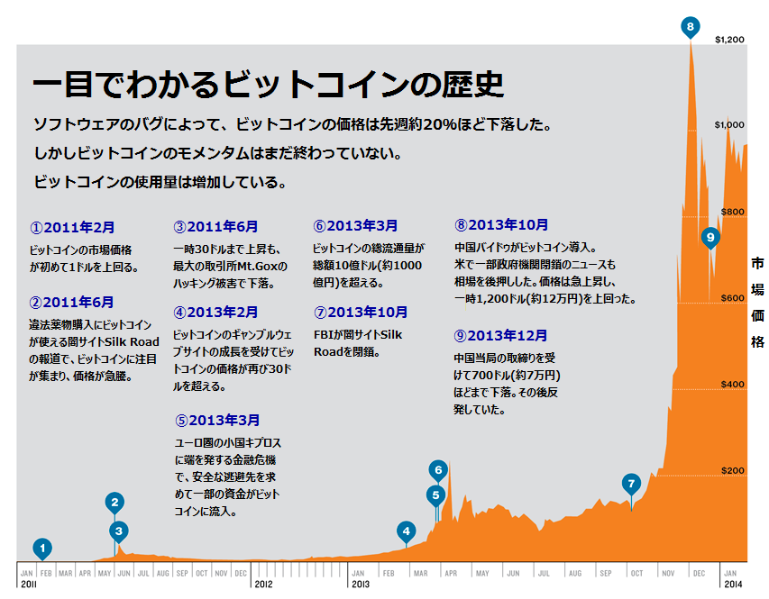

name: inverse
layout: true
class: center, middle, inverse
---
## 今更聞けない仮想通貨まわり

---
layout:false
## 仮想通貨とは

* サトシ・ ナカモトを名乗る日本人が論文発表。全てはこの短い論文から始まった(https://bitcoin.org/bitcoin.pdf) 正体はオーストラリア人男性、クレイグ・ライト氏らしい。騒動に巻き込まれたオッサンに寄付が集まるw [参考](http://gigazine.net/news/20141015-dorian-nakamoto-legal-defense-fund) 

* ブロックチェーン技術が特徴。分散したコンピューターにトランザクションを記録した台帳を持ち、ネット上で監視させることで信用を担保。国の保護という中央集権システムからの脱却し、P2Pで個人間で取引可能 

* ブロックチェーン技術といえば、ビットコインを思い浮かべるが、著作権の保護や投票システム、ドメイン管理、株の管理などにも応用が可能。あるアナリストによるとブロックチェーン技術に見込まれる潜在市場価値は約2130兆円、世界のGDPが9000兆円なので世界の4分の1が変わるインパクト

---
##銀行も紙幣もなくなる？ 危機感を感じた金融機関が必死に研究中

* 本人確認の業務や送金、クレジットカードの不正利用のチェックなど、銀行業務が必要なくなる？ 銀行は2022年までに2500兆円相当の業務コストを削減できると言われている

* ゴールドマン・サックスが3800億以上かけて研究

* R3cevという団体に世界のメガバンクが参加し、研究中

---
## 日本は仮想通貨後進国

* 国内送金に不便を感じない。早いし、手数料も数百円、島国なので海外送金もあまりしない。アメリカだとNYからロサンゼルスまで送金するのに、3・5日もかかるらしい、しかも手数料が2、3千円もかかる

* 自国の通貨に不安がない。GDPの二倍も借金しているが、破綻はないと思っている。過去日本は戦前と戦後の２回破綻しているらしい世界でもあまりインフレしない通貨だと思われているので、リスクが高まった時に円が買われる

* 日本人の国民性。Mt.Goxが破綻したので怪しいでもあれは取引所が潰れただけ
FXの会社が破綻したからドル円は信用出来ないと言っているようなもの全くの筋違い。皆が手を出さない怪しいものは採用しないそのくせキャズムを超えて流行りだすと手のひらを返す。村八分の国民性

---
## 海外では

* 中国は人民元に不安があるので、積極的に仮想通貨が買われている。ビットコインが12万まで高騰した背景には中国人の爆買いがあったらしい。あまりに熱狂したので中国政府が規制

* 海外では送金が遅く、手数料高い。口座が開けない人が沢山いる。ここを仮想通貨が解決してくれる。

* スカンジナビア半島の国は仮想通貨先進国。デンマークは中央銀行が仮想通貨を発行しようとしている

---
## 主な仮想通貨

* やはりビットコインが時価総額1位、それでも1兆3000億くらい、twitterは超えているらしい。当初は1ビットコイン0.1セント、現在は84000円くらい。2009年からの8年足らずで84万倍。1万円で10万ビットコイン買っていたら、84億円…。ちなみに最初に買われたのはピザで1万ビットコイン、つまり8億4000万円のピザw アメリカのダークウェブ、SilkRoad、ギリシャの破綻に伴うキプロスショック、中国人の爆買いなどで上昇

* 発行量は決まっており2140年までに2100万BTCを発行する。既に75%が発行済み。半減期と言ってマイニングの量が徐々に減っていく。

* 送金の手数料がマイナーの手に渡る。採掘が終わったらトレードやトランザクションでしかもらえない

* 税金周りがどうなるか。2017年に改正資金決済法で取引所に対する法整備

---

---
## オルトコイン
* ビットコイン以外はオルトコインと呼ばれる。有名なのはイーサリアム。スマートコントラクトと言って、契約情報をデータに持たせる。契約の改ざんができない。チャールズ・ ホスキンソンという天才科学者が作成。他にはリップルコインというグーグルが出資したコインが有名。

* モナーコインという２ちゃんねらーが作成した仮想通貨がある。もうだいぶ廃れている模様。かつてはモナオクというオークションサイトがあった

* セキュリティが脆弱で盗難が発生し、ソフトフォーク(ソフトなアップデート)でなかったことにしたものの、大暴落した通貨もある。投機の対象としては面白いが詐欺も横行している模様。取引所に未上場の通貨は信用できない

* [アロハコインの詐欺](http://www.alohacoin.eu/%E7%A0%B4%E7%B6%BB%E3%81%97%E3%81%9F%E3%82%A2%E3%83%AD%E3%83%8F%E3%82%B3%E3%82%A4%E3%83%B3)

---
## 仮想通貨の二つの種類

* 採掘するカレンシータイプの通貨。今まで見てきた採掘量が決まっている通貨

* 発行者がいるアセットタイプの通貨。CounterPartyというオープンソースの金融プラットフォーム(テックビューロ社のZaicaなど)で、トークンというものを発行する。平たく言うと株や貨幣を好きに発行できる。どういう付加価値をもたらすかは発行者のアイデア次第。

* 東京三菱UFJのMUFGコインはこのタイプらしい

* ホリエモンがホリエモンカードを発行w 2日で10倍の値上がりをしたらしい。

* 詐欺がめっちゃ横行しているらしい。まさしく未公開未上場の怪しい株を売りつけるみたいな感じか。

---
## まとめ

新しい技術、概念が続々誕生してカオスな状態を呈している。黎明期ならではのチャンスもあるが、乱高下のリスクがあり、詐欺なども横行している。
インターネットの黎明期に似てる。

ネットの技術なので権力や権威が潰すことが出来ず、開発して利益につなげようとしている。日本よりも海外で必要性があるので、海外でもっと流行りそう。そしてその影響を日本は受ける。
投資・投機をする時は気をつけましょう。といいつつも最近怪しい仮想通貨を投機目的で買ってしまいましたw

個人的には仮想通貨は既存の通貨を駆逐すること無く共存し、それよりもブロックチェーンの技術が様々な所で応用されて、既存の仕組みを置換していくと思います(小並感)
